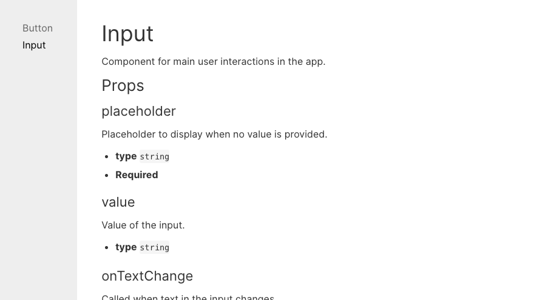

# gatsby-react-docs

Example showing how to set up documentation site with Gatsby that reads your components and automatically generates doc pages straight from your code.



## Usage

1. Install fake library dependencies.

```bash
yarn
```

2. Go to `/docs`.

```bash
cd docs
```

3. Install Gatsby and other dependencies.

```bash
yarn
```

4. Start Gatsby dev mode.

```bash
gatsby develop
```

5. Visit `http://localhost:8000`.

6. Edit anything in `src/components` and see how it live updates.

## Relevant files

In Gatsby, have a look at:

- `docs/gatsby-config.js` – added `gatsby-source-filesystem` there.
- `docs/gatsby-node.js` – responsible for parsing the files and injecting them to Gatsby.
- `dos/src/pages/index.js` – cleaned it up.
- `docs/src/components/doc-layout.js` – serves role of a layout for the doc files. If you want to change anything in how docs display, look there.
- `docs/src/components/layout.css` – made some changes there to make the site feel more like docs than in default styling.
- `docs/src/components/layout.js` – added sidebar and cleaned the file.
- `docs/src/components/Sidebar.js` – displays list of components.
